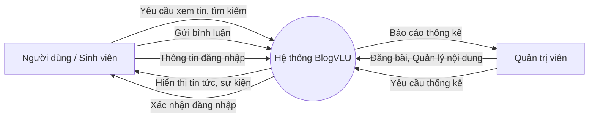
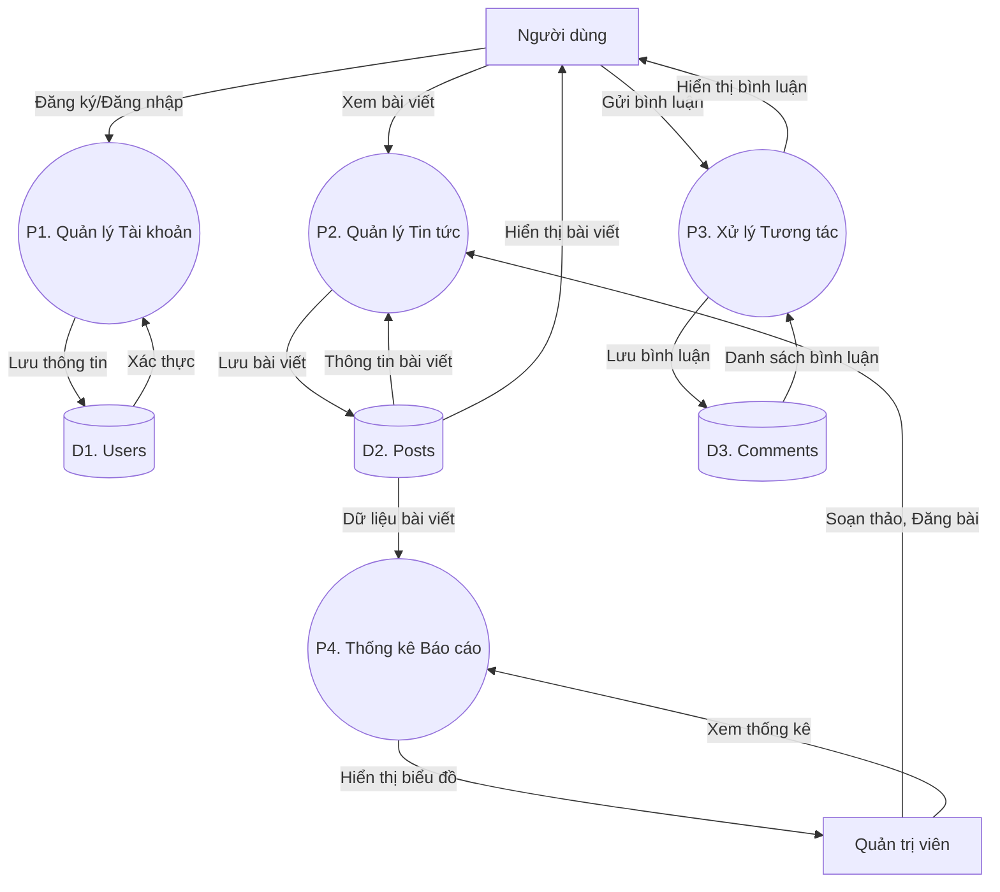
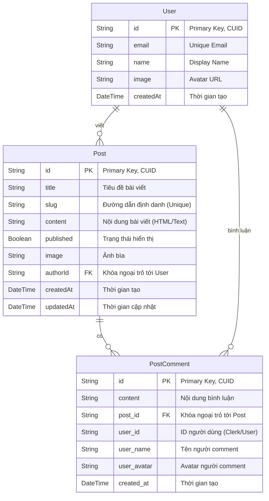

# Phân Tích Hệ Thống BlogVLU

Tài liệu này tổng hợp các sơ đồ phân tích hệ thống cho dự án BlogVLU phục vụ cho việc báo cáo.

## 1. Sơ đồ phân cấp chức năng (Functional Decomposition Diagram - FDD)

Hệ thống được chia thành 2 phân hệ chính: **Người dùng (End-User)** và **Quản trị viên (Admin)**.

```mermaid
graph TD
    Root[Hệ thống BlogVLU]
    
    %% Phân hệ người dùng
    Root --> UserSystem[Phân hệ Người dùng]
    UserSystem --> ViewContent[Xem Nội dung]
    ViewContent --> ViewHome[Trang chủ & Giới thiệu]
    ViewContent --> ViewBlog[Xem danh sách Blog]
    ViewContent --> ViewPostDetail[Xem chi tiết bài viết]
    ViewContent --> ViewEvents[Xem Sự kiện]
    
    UserSystem --> Interaction[Tương tác]
    Interaction --> Comment[Bình luận bài viết]
    Interaction --> Search[Tìm kiếm tin tức/sự kiện]
    
    UserSystem --> UserAuth[Xác thực Người dùng]
    UserAuth --> Login[Đăng nhập / Đăng ký]
    UserAuth --> Profile[Xem thông tin cá nhân]

    %% Phân hệ Admin
    Root --> AdminSystem[Phân hệ Quản trị]
    AdminSystem --> Dashboard[Thống kê Dashboard]
    Dashboard --> StatViews[Thống kê lượt xem]
    Dashboard --> Chart[Biểu đồ tăng trưởng]
    
    AdminSystem --> ManagePost[Quản lý Bài viết]
    ManagePost --> CreatePost[Soạn thảo & Đăng bài]
    ManagePost --> EditPost[Chỉnh sửa bài viết]
    ManagePost --> DeletePost[Xóa bài viết]
    ManagePost --> UploadImg[Upload hình ảnh]
    
    AdminSystem --> AdminAuth[Bảo mật]
    AdminAuth --> ProtectRoute[Phân quyền truy cập]
```

---

## 2. Sơ đồ luồng dữ liệu (Data Flow Diagram - DFD)

### Mức ngữ cảnh (Level 0)

Sơ đồ tổng quát thể hiện sự tương tác giữa các tác nhân và hệ thống.

### Mức đỉnh (Level 1)

Phân rã hệ thống thành các tiến trình xử lý chính.

---

## 3. Sơ đồ liên kết thực thể (Entity Relationship Diagram - ERD)

Dựa trên cấu trúc Database hiện tại (Prisma Schema).

*Ghi chú quan hệ:*
*   Một **User** có thể viết nhiều **Post** `(1..n)`.
*   Một **Post** thuộc về một **User** `(1..1)`.
*   Một **Post** có thể có nhiều **PostComment** `(1..n)`.
*   Một **PostComment** thuộc về một **Post** `(1..1)`.
*   Người dùng (User) cũng thực hiện Comment, nhưng trong bảng `PostComment` hiện đang lưu thông tin snapshot (user_name, user_avatar) để tối ưu hiển thị.

---

## 4. Sơ đồ quan hệ dữ liệu (Relational Schema)

Mô tả chi tiết các bảng (Tables) trong Cơ sở dữ liệu PostgreSQL.

### Bảng `User`
| Tên trường (Field) | Kiểu dữ liệu (Type) | Ràng buộc (Constraint) | Mô tả |
| :--- | :--- | :--- | :--- |
| **id** | VARCHAR(30) | **PK**, NOT NULL | Mã định danh người dùng (CUID) |
| email | VARCHAR(255) | UNIQUE, NOT NULL | Email đăng nhập |
| name | VARCHAR(255) | NULL | Tên hiển thị |
| image | TEXT | NULL | URL ảnh đại diện |
| createdAt | TIMESTAMP | DEFAULT NOW() | Ngày tạo tài khoản |

### Bảng `Post`
| Tên trường (Field) | Kiểu dữ liệu (Type) | Ràng buộc (Constraint) | Mô tả |
| :--- | :--- | :--- | :--- |
| **id** | VARCHAR(30) | **PK**, NOT NULL | Mã bài viết (CUID) |
| title | VARCHAR(255) | NOT NULL | Tiêu đề bài viết |
| slug | VARCHAR(255) | UNIQUE, NOT NULL | URL thân thiện (ví dụ: bai-viet-so-1) |
| content | TEXT | NULL | Nội dung chi tiết (HTML) |
| published | BOOLEAN | DEFAULT FALSE | `true`: Đã đăng, `false`: Nháp |
| image | TEXT | NULL | URL ảnh bìa bài viết |
| **authorId** | VARCHAR(30) | **FK** (Ref User.id) | Tác giả bài viết |
| createdAt | TIMESTAMP | DEFAULT NOW() | Thời gian tạo |
| updatedAt | TIMESTAMP | AUTO UPDATE | Thời gian cập nhật lần cuối |

### Bảng `PostComment` (Map: `post_comments`)
| Tên trường (Field) | Kiểu dữ liệu (Type) | Ràng buộc (Constraint) | Mô tả |
| :--- | :--- | :--- | :--- |
| **id** | VARCHAR(30) | **PK**, NOT NULL | Mã bình luận |
| content | TEXT | NOT NULL | Nội dung bình luận |
| **post_id** | VARCHAR(30) | **FK** (Ref Post.id, CASCADE) | Thuộc bài viết nào |
| user_id | VARCHAR(255) | NOT NULL | ID người bình luận |
| user_name | VARCHAR(255) | NOT NULL | Tên hiển thị lúc bình luận |
| user_avatar | TEXT | NULL | Avatar người dùng lúc bình luận |
| created_at | TIMESTAMP | DEFAULT NOW() | Thời gian bình luận |
